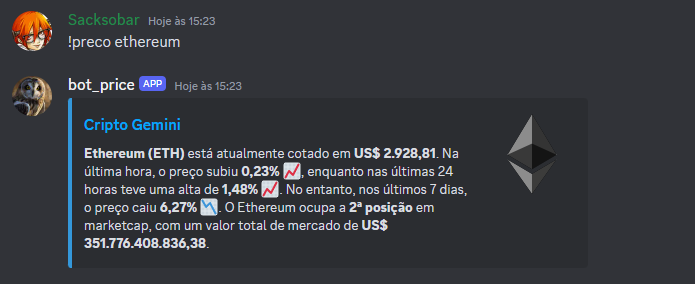
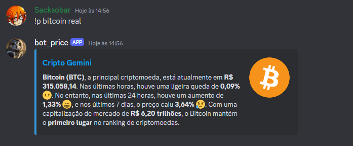

# Criptomoedas-com-Gemini-IA

## CryptoBot é um bot Discord que fornece informações em tempo real sobre criptomoedas, utilizando a inteligência do Gemini AI.

## Motivação:

A motivação principal para realizar este projeto foi que,  Apesar de suas capacidades avançadas, o Gemini AI ainda não possui acesso direto a dados de mercado de criptoativo. Visando suprir essa lacuna, este projeto utiliza uma API de criptomoedas para obter os dados mais recentes e os fornece ao Gemini AI. O resultado é um bot para Discord que entrega, de forma concisa e compreensível, as informações desejadas sobre a criptomoeda escolhida pelo usuário.

Em resumo o projeto busca:

- **Expandir as capacidades do Gemini AI:** integrando-o com dados de mercado em tempo real;
- **Criar uma ferramenta útil para a comunidade:** um bot Discord que simplifica o acesso a informações sobre criptomoedas.
## Funcionalidades:

- **Preços em Tempo Real:** Consulte os preços atuais de diversas criptomoedas diretamente no seu servidor Discord.
- **Mudanças Detalhadas:** Obtenha informações sobre as mudanças percentuais da criptomoeda na última hora, 24 horas e 7 dias, com explicações claras e concisas geradas pelo Gemini AI.
- **Capitalização de Mercado:** Saiba a posição da criptomoeda no ranking de capitalização de mercado.
- **Explicações em Linguagem Natural:** Todas as informações são apresentadas de forma clara e fácil de entender, graças ao poder de processamento de linguagem natural do Gemini AI.

## Como Usar:

1. Adicione o CryptoBot ao seu servidor Discord.
2. Utilize o comando `!preco <criptomoeda>` para consultar informações sobre a moeda desejada (ex: `!preco Bitcoin`). Utilize `!preco bitcoin real` caso queira o preço em Real.

## Tecnologia:

- **Gemini AI:** Processamento de linguagem natural, análise de sentimento e geração de texto.
- **Discord.py:** Biblioteca para interação com a API do Discord.
- **API de Criptomoedas:** API do CoinMarketCap.

## Contribuição:

Sinta-se à vontade para contribuir com o projeto! Você pode:
- Reportar bugs e problemas.
- Sugerir novas funcionalidades.
- Melhorar o código existente.
- Adicionar suporte a novas APIs de criptomoedas.

